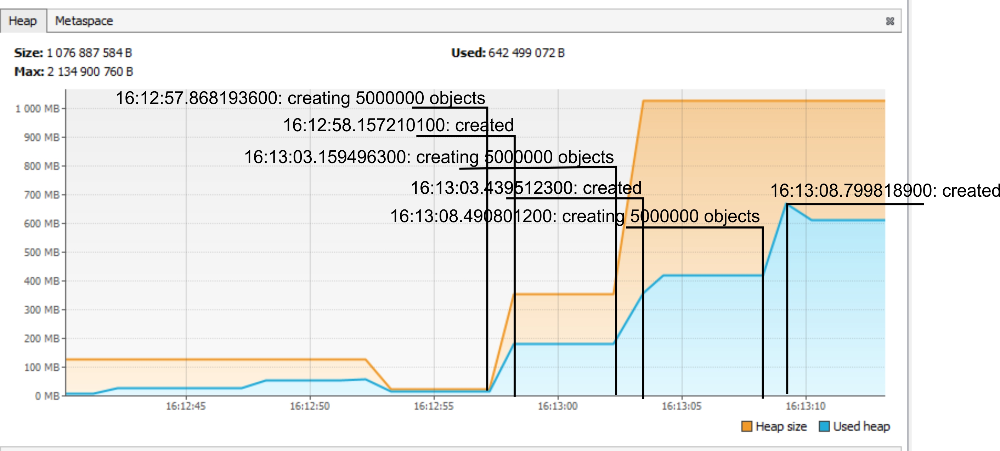

Домашнее задание для Netology.ru для курса Java Developer   

Описание и инструкция к выполнению [здесь](https://github.com/netology-code/jd-homeworks/tree/master/jvm/README.md)

# Задача "Исследование JVM через VisualVM"

На графике подгрузки новых классов (Classes) каждая новая операция по загрузке новых классов из указанных пакетов (io.vertx, io.netty, org.springframework) приводит к тому, что на графике числа классов, загруженных JVM происходит скачок этого самого количетва загруженных машиной байт-кодов классов. В принципе даже наблюдается соответсвие между величинами скачков на графике и кол-вом классов, загружаемых с каждым из пакетов.

На графике занятого на момент времени объема кучи (Heap) видно, как происходит создание очередных порций объектов по 5 000 000 штук (creating 5000000 objects) - каждая такая операция приводит к росту памяти кучи, используемой приложением. Окончание операции создания объектов по графику можно легко увидеть, когда график перестает расти. При этом наблюдаются примерно равные скачки по размеру памяти, т.е. размеры создаваемых объектов примерно равны. Интересный момент, что при росте используемой памяти кучи, объем кучи увеличивается.
